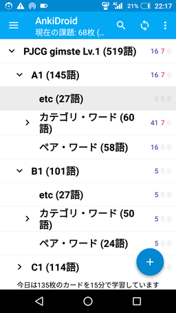
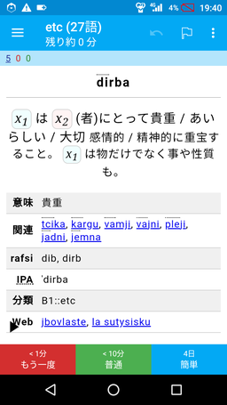
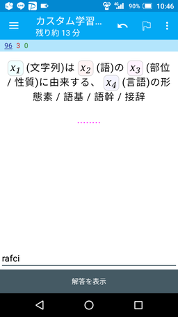
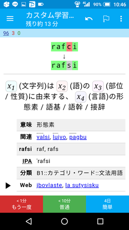
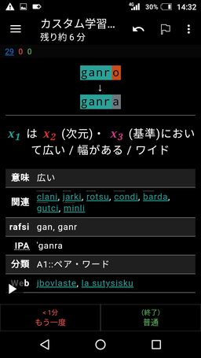

<!--
## File: readme.md
##
## 「ji'u la'o .zoi. PJCG gimste .zoi.」の日本語マニュアル。
##
## Metadata:
##
##   author - qq542vev <https://purl.org/meta/me/>
##   version - 0.1.5
##   date - 2021-05-05
##   since - 2021-04-01
##   copyright - Copyright (C) 2021 qq542vev. Some rights reserved.
##   license - CC-BY <https://creativecommons.org/licenses/by/4.0/>
##   package - jihu-laho-zoi-pjcg-gimste-zoi
##
## See Also:
##
##   * Project homepage - <https://github.com/qq542vev/jihu-laho-zoi-pjcg-gimste-zoi>
##   * Bag report - <https://github.com/qq542vev/jihu-laho-zoi-pjcg-gimste-zoi/issues>
-->

# ji'u la'o .zoi. PJCG gimste .zoi.

このプロジェクトは[PJCG gimste](https://cogas.github.io/pages/lojbo/pjcg_gimste/)の成果に基づいて、新たな学習教材を作成する試みです。

PJCG gimsteは人工言語ロジバンの重要なgismuを選定するプロジェクトです。[ロジバン若手の会](https://groups.google.com/g/ponjo_lojbo_citno_girzu)のメンバーの方々が使用頻度が多いgismuの中からより重要なものを選定し、[cogas](https://cogas.github.io/)さんによって纏められました。

# 成果物

 * [Ankiのデッキパッケージ](https://github.com/qq542vev/jihu-laho-zoi-pjcg-gimste-zoi/releases)
 * [「PJCG gimste」のgismuを更に減らす実験的試み](gasnu-lo-nu-lo-gismu-ku-tohe-zenba.md)

## Ankiのデッキパッケージ

[Anki](https://apps.ankiweb.net/)のデッキパッケージを使用することで、PCやスマートフォンで効率的にgismuの学習が行えます。

    

Ankiのデッキにはロジバンから日本語のカードと日本語からロジバンのカードと日本語からロジバン(入力問題)のカードの3種類が含まれています。カードブラウザの検索欄に `"note:PJCG gimste Lv.1" card:1` と入力するとロジバンから日本語のカードの一覧が、 `"note:PJCG gimste Lv.1" card:2` と入力すると日本語からロジバンのカードの一覧が、 `"note:PJCG gimste Lv.1" card:3` と入力すると日本語からロジバン(入力問題)のカードの一覧が表示されます。「全て選択」、「カードを保留」と選択することで、当該カードを一括で非表示に出来ます。

# 謝辞

このプロジェクトはPJCG gimsteを基にしています。PJCG gimsteの作成者の皆様に感謝の意を表します。
