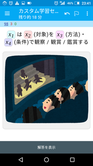
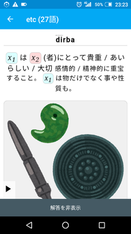
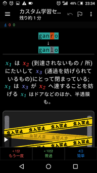

<!--
## File: readme.md
##
## 「ji'u la'o .zoi. PJCG gimste .zoi.」の日本語マニュアル。
##
## Metadata:
##
##   author - qq542vev <https://purl.org/meta/me/>
##   version - 0.1.8
##   date - 2022-02-13
##   since - 2021-04-01
##   copyright - Copyright (C) 2021 qq542vev. Some rights reserved.
##   license - CC-BY <https://creativecommons.org/licenses/by/4.0/>
##   package - jihu-laho-zoi-pjcg-gimste-zoi
##
## See Also:
##
##   * Project homepage - <https://github.com/qq542vev/jihu-laho-zoi-pjcg-gimste-zoi>
##   * Bag report - <https://github.com/qq542vev/jihu-laho-zoi-pjcg-gimste-zoi/issues>
-->

# ji'u la'o .zoi. PJCG gimste .zoi.

このプロジェクトは[PJCG gimste](https://cogas.github.io/pages/lojbo/pjcg_gimste/)の成果に基づいて、新たな学習教材を作成する試みです。

PJCG gimsteは人工言語ロジバンの重要なgismuを選定するプロジェクトです。[ロジバン若手の会](https://groups.google.com/g/ponjo_lojbo_citno_girzu)のメンバーの方々が、使用頻度が多いgismuの中からより重要なものを選定し、[cogas](https://cogas.github.io/)さんによって纏められました。

# 成果物

 * [Ankiのデッキパッケージ](https://github.com/qq542vev/jihu-laho-zoi-pjcg-gimste-zoi/releases)
 * [PJCG gimsteのgismuを更に減らす実験的試み](gasnu-lo-nu-lo-gismu-ku-tohe-zenba.md)
 * [単語暗記カード印刷用](https://qq542vev.github.io/jihu-laho-zoi-pjcg-gimste-zoi/prina/)
 * [PJCG gimsteのgismu一覧](https://qq542vev.github.io/jihu-laho-zoi-pjcg-gimste-zoi/liste/)

## Ankiのデッキパッケージ

[Anki](https://apps.ankiweb.net/)のデッキパッケージを使用することで、PCやスマートフォンで効率的にgismuの学習が行えます。

   

### カードタイプ

このデッキパッケージには4種類のカードタイプがあります。それぞれのカードタイプに含まれるカードの一覧を表示するには、カードブラウザの検索欄に次のように入力します。

 * `"note:PJCG gimste Lv.1" "card:1"` - ロジバンから日本語のカード
 * `"note:PJCG gimste Lv.1" "card:2"` - 日本語からロジバンのカード
 * `"note:PJCG gimste Lv.1" "card:3"` - 日本語からロジバン(入力問題)のカード
 * `"note:PJCG gimste Lv.1" "card:4"` - rafsiから日本語のカード

「全て選択」、「カードを保留」と選択することで、当該カードを一括で保留に出来ます。

### 情報の非表示

カードには問題と正解以外にも、関連した様々な情報が含まれます。カードに以下の任意のタグを追加することで、当該カード内の不要な情報を非表示に出来ます。

 * `datni-mipri` - 詳細情報を非表示
 * `mupli-mipri` - 例文を非表示
 * `notci-mipri` - 補足説明を非表示
 * `pixra-mipri` - 画像を非表示

# ToDo

# 謝辞

このプロジェクトはPJCG gimsteを基にしています。PJCG gimsteの作成者の皆様に感謝の意を表します。
