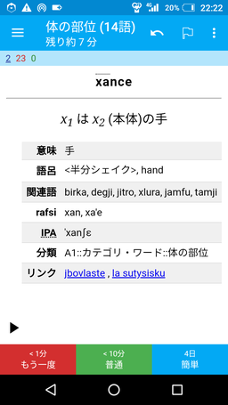

<!--
## File: readme.md
##
## 「ji'u la'o .zoi. PJCG gimste .zoi.」の日本語マニュアル。
##
## Metadata:
##
##   author - qq542vev <https://purl.org/meta/me/>
##   version - 0.1.0
##   date - 2021-04-02
##   since - 2021-04-01
##   copyright - Copyright (C) 2021 qq542vev. Some rights reserved.
##   license - CC-BY <https://creativecommons.org/licenses/by/4.0/>
##   package - jihu_laho_zoi_pjcg_gimste_zoi
##
## See Also:
##
##   * Project homepage - <https://github.com/qq542vev/jihu_laho_zoi_pjcg_gimste_zoi>
##   * Bag report - <https://github.com/qq542vev/jihu_laho_zoi_pjcg_gimste_zoi/issues>
-->

# ji'u la'o .zoi. PJCG gimste .zoi.

このプロジェクトは[PJCG gimste](https://cogas.github.io/pages/lojbo/pjcg_gimste/)の成果に基づいて、新たな学習教材を作成する試みです。

PJCG gimsteは人工言語ロジバンの重要なgismuを選定するプロジェクトです。[ロジバン若手の会](https://groups.google.com/g/ponjo_lojbo_citno_girzu)のメンバーの方々が使用頻度が多いgismuの中からより重要なものを選定し、[.cogas.](https://cogas.github.io/)さんによって纏められました。

# 成果物

 * [Ankiのデッキパッケージ](https://github.com/qq542vev/jihu_laho_zoi_pjcg_gimste_zoi/releases)

## Ankiのデッキパッケージ

[Anki](https://apps.ankiweb.net/)のデッキパッケージを使用することで、PCやスマートフォンで効率的にgismuの学習が行えます。

 

# 謝辞

このプロジェクトはPJCG gimsteを基にしています。PJCG gimsteの作成者の皆様に感謝の意を表します。
